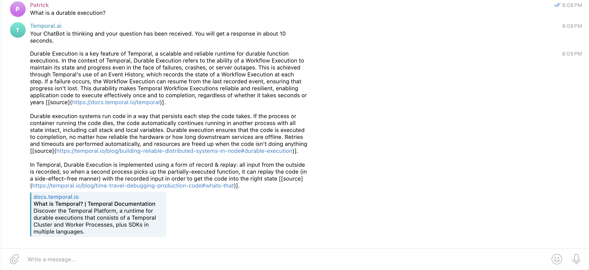

# Telegram AI bot

This is a Telegram AI bot that sends Kapa AI responses backed by a Temporal Workflow.

## How to run

1. Create a `.env` file with the following variables:

```env
KAPA_API_ENDPOINT=<Your Kapa API endpoint>
KAPA_API_TOKEN=<Your API token>
TELEGRAM_BOT_TOKEN=<Your Telegram bot token>
```

2. Start the app

```python
# terminal one
poetry run python app/main.py
# terminal two
poetry run python app/starter.py
```

3. Send a message to the bot

Open your Telegram bot's dashboard and send a message to the bot.

